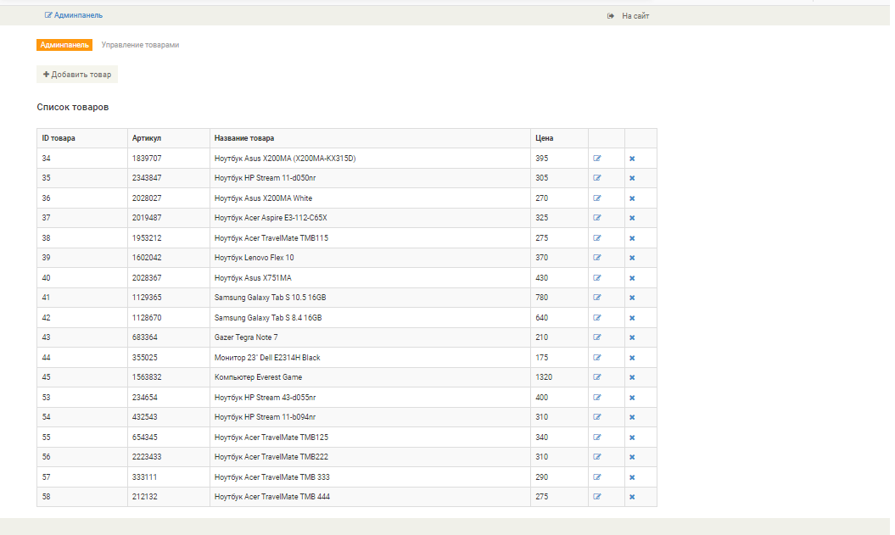
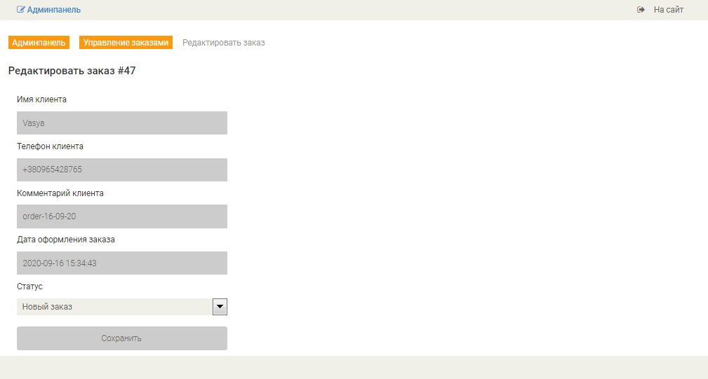

# Простой интернет-магазин на php

(По видеокурсу на youtube.com Victor Zinchenko PHP Start | Практика)

### Назначение

Учебный проект для ознакомления и лучшего понимания шаблона MVC в веб-разработке.

### Среда разработки

php-7.0, MySQL-5.7, jQuery v1.10.2 

### Верстка

На базе шаблона Bootstrap E-Shopper 

### Перечень страниц

#### Пользовательская часть 

1. Главная страница 
2. Каталог
	1. Каталог товаров 
	2. Страница категории 
	2. Страница товара 
3. Корзина 
	1. Просмотр-редактирование заказа 
	2. Оформление заказа 
4. Кабинет пользователя
	1. Страница приветствия 
	2. Редактирование данных 
5. Регистрация 
6. Авторизация 

#### Административная часть

1. Шаблон панели администратора
	1. Проверка прав доступа – отказ в доступе 
	2. Меню панели администратора 
2. Управление товарами
	1. Добавление 
	2. Список 
	3. Редактирование 
3. Управление категориями
	1. Добавление 
	2. Список 
	3. Редактирование 
4. Управление заказами
	1. Список заказов 
	2. Редактирование 

### Вид страниц

 ##### Рис. 1. Главная страница

 
 

##### Рис. 2.1. Каталог товаров

 
 

##### Рис. 2.2. Страница категории

 
 

##### Рис. 2.3. Страница товара

 
 

##### Рис. 3.1. Корзина. Просмотр - редактирование заказа

 
 

##### Рис. 3.2. Корзина. Оформление заказа

 
 

##### Рис. 4.1. Кабинет пользователя. Приветствие

 
 

##### Рис. 4.2. Кабинет пользователя. Редактирование

 
 

##### Рис. 5. Регистрация

 
 

##### Рис. 6. Авторизация

 
 

##### Рис. 7.1. Панель администратора. Отказ в доступе.

 
 

##### Рис. 7.2. Панель администратора. Меню

 
 

##### Рис. 8.1. Управление категориями. Добавить

 
 

##### Рис. 8.2. Управление категориями. Список

 
 

##### Рис. 8.3. Управление категориями. Редактировать

 
 

##### Рис. 9.1. Управление товарами. Добавить

 
 

##### Рис. 9.2. Управление товарами. Список

 
 

##### Рис. 9.3. Управление товарами. Редактировать

 
 

##### Рис. 10.1. Управление заказами. Список

 
 

##### Рис. 10.2. Управление заказами. Редактировать